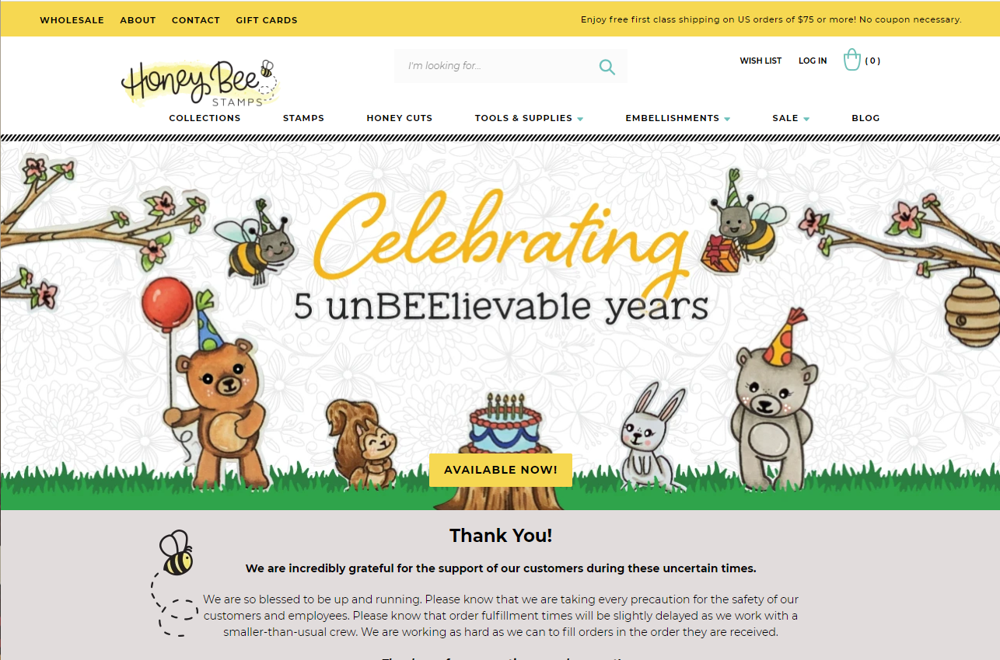
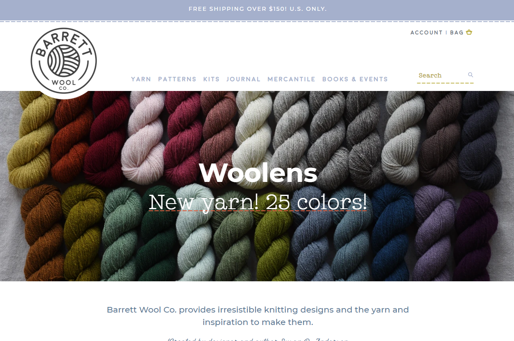
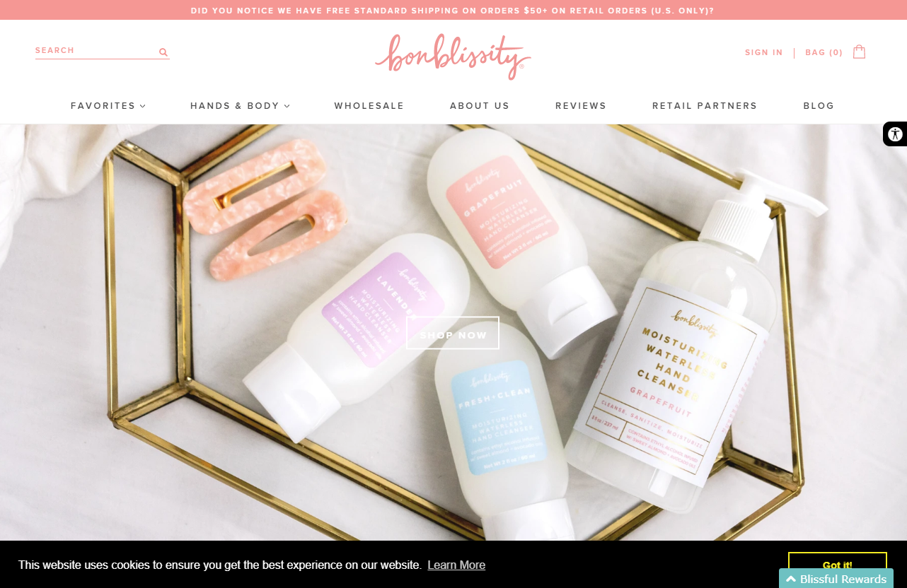
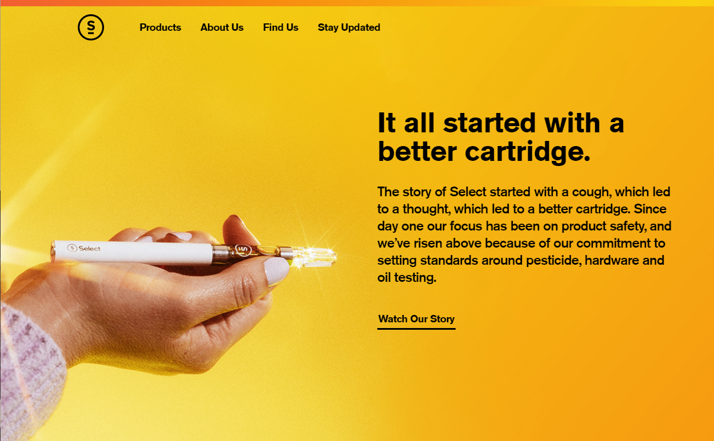
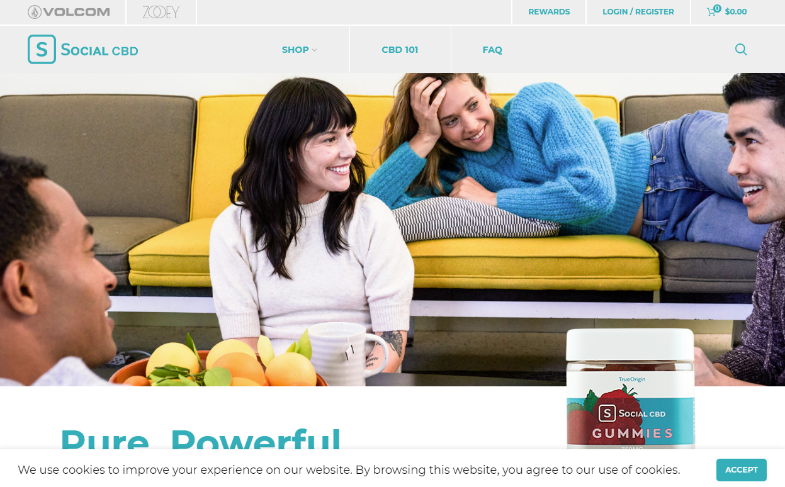
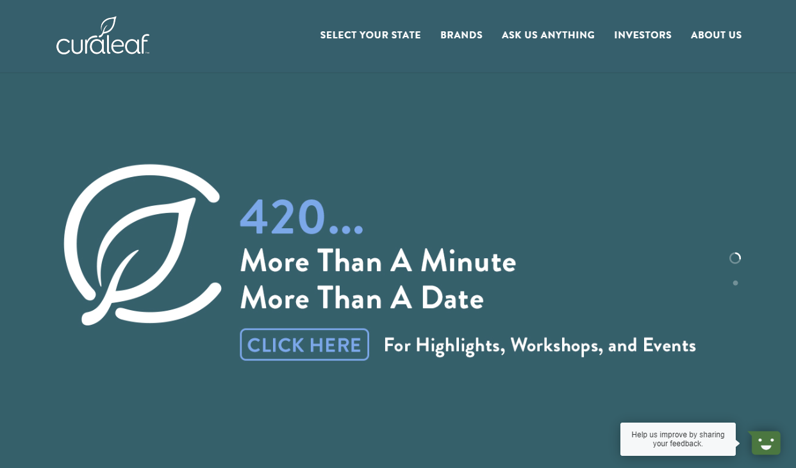

# kielcorwin.github.io

<!DOCTYPE html>
<html><head><meta http-equiv="Content-Type" content="text/html; charset=UTF-8">

<link rel="stylesheet" type="text/css" href="./Kiel Corwin - UI_UX Designer - Interactive Developer_files/banner-styles.css">
<link rel="stylesheet" type="text/css" href="./Kiel Corwin - UI_UX Designer - Interactive Developer_files/iconochive.css">
<!-- End Wayback Rewrite JS Include -->

    
    <meta http-equiv="X-UA-Compatible" content="IE=edge,chrome=1">
    <meta name="viewport" content="width=device-width, initial-scale=1">

    <title>Kiel Corwin - UI/UX Designer - Interactive Developer</title>

    
    
    <link rel="stylesheet" href="./Kiel Corwin - UI_UX Designer - Interactive Developer_files/bootstrap.min.css" integrity="" crossorigin="anonymous">
    

    <link href="./Kiel Corwin - UI_UX Designer - Interactive Developer_files/css" rel="stylesheet">
    <link rel="stylesheet" href="./Kiel Corwin - UI_UX Designer - Interactive Developer_files/style.css">

    <link rel="stylesheet" href="./Kiel Corwin - UI_UX Designer - Interactive Developer_files/lightboxgallery-min.css">
    <link rel="stylesheet" href="./Kiel Corwin - UI_UX Designer - Interactive Developer_files/lightbox-style.css">

</head>

<body class=""><!-- BEGIN WAYBACK TOOLBAR INSERT -->

  

    <iframe id="donato-if" src="./Kiel Corwin - UI_UX Designer - Interactive Developer_files/donate.html" scrolling="no" frameborder="0" style="width:100%; height:100%">
    </iframe>
  

<!-- END WAYBACK TOOLBAR INSERT -->
    <header>
        <a href="https://web.archive.org/web/20190717235552/mailto:kiel@kielcorwin.com">kiel@kielcorwin.com</a>
        <a href="https://web.archive.org/web/20190717235552/tel:1-503-432-3439">503.432.3439</a>
        <h1>Kiel Corwin</h1>
        <h2>UI/UX Designer</h2>
        <h2>Interactive Developer</h2>
    </header>

    <a href="img/Kiel_Corwin_Resume_2020" class="resume-link">Resume</a>
<section class="clearfix">
        
10/19 - 3/20

        
ASMLFront End Developer

        
Work with local and international team to develop a React application for scheduling high pressure
maintenence on multimillion dollar equipment. Duties included refactoring legacy code, implementing
new features, writing tests and developing manual testing documentation.

		

            <a class="lightboxgallery-gallery-item" target="_blank" href="img/asml.png" data-title="ASML Logo" data-alt="ASML Logo" data-desc="ASML Logo">
                

                  
                  

                    ASML Logo
                  

                

            </a>

	</section>
<section class="clearfix">
        
2/19 - 10/19

        
AeolidiaShopify Developer

        
Develop customized Shopify, WordPress and all associated applications for new and existing storefronts
and other sales tools. Edit HTML/CSS/Javascript/Liquid/PHP to match design comps. Work closely with
the client to analyze their needs and develop a unique plan to increase sales with improved aesthetics
and analytics. Optimize their front and back end for improved SEO, reduced loading times and better
customer experience.

		

            <a class="lightboxgallery-gallery-item" target="_blank" href="img/aeo1.png" data-title="Honeybee Stamps site" data-alt="Honeybee Stamps site" data-desc="Honeybee Stamps site">
                

                  
                  

                    Honeybee Stamps site.
                  

                

            </a>
            <a class="lightboxgallery-gallery-item" target="_blank" href="img/aeo2.png" data-title="Barrett Wool Company" data-alt="Barrett Wool Company" data-desc="Barrett Wool Company">
                

                  
                  

                    Barrett Wool Company
                  

                

            </a>
            <a class="lightboxgallery-gallery-item" target="_blank" href="img/aeo3.png" data-title="Bonblissity" data-alt="Bonblissity" data-desc="Bonblissity">
                

                  
                  

                    Bonblissity
                  

                

            </a>
        

</section>

        <section class="clearfix">
        
11/18 - 2/19

        
CuraWeb Developer

        
Responsible for updating and maintaining 3 main company websites and handling all web related business.  Cleaned, upgraded and optimized out of date WordPress installations.  Customized and maintained Shopify storefront that had very high sales per month.  Coded full responsive redesign of <a href="https://web.archive.org/web/20190717235552/https://selectoil.com/">selectoil.com</a>.  Created marketing e-mails and one off sites for promotions.  Integrated SEO, analytics and other affiliate tracking systems.
								<ul>
									<li>Wordpress</li>
                                                                        <li>Shopify</li>
                                                                        <li>Custom hand coded HTML/CSS</li>
                                                                        <li>Analytics</li>
                                                                        <li>Hosting maintenence and optimization</li>
                                                                        <li><a href="https://web.archive.org/web/20190717235552/https://selectoil.com/">Selectoil.com</a></li>
                                                                        <li><a href="https://web.archive.org/web/20190717235552/https://selectcbd.com/">SelectCBD.com</a></li>
                                                                        <li><a href="https://web.archive.org/web/20190717235552/https://curacan.com/">Curacan.com</a></li>
								</ul>
								

        

            <a class="lightboxgallery-gallery-item" target="_blank" href="img/cura3.png" data-title="SelectCBD.com Shopify site" data-alt="SelectCBD.com Shopify site" data-desc="SelectCBD.com Shopify site">
                

                  
                  

                    SelectCBD.com Shopify site.
                  

                

            </a>
            <a class="lightboxgallery-gallery-item" target="_blank" href="img/cura2.png" data-title="SelectOil.com redesign" data-alt="SelectOil.com redesign" data-desc="SelectOil.com redesign">
                

                  
                  

                    SelectOil.com redesign
                  

                

            </a>
            <a class="lightboxgallery-gallery-item" target="_blank" href="img/cura1.png" data-title="Curacan.com Blog" data-alt="Curacan.com Blog" data-desc="Curacan.com Blog">
                

                  
                  

                    Curacan.com Blog
                  

                

            </a>
        

    </section>

    <section class="clearfix">
        
11/14 - 8/18

        
Banfield Pet HospitalUI/UX Developer

        
Created prototypes in HTML/CSS/Javascript for a ground up redesign of existing hospital software responsible for handling
								patient and client information, medical records, diagnosis feedback and scheduling for over 900 hospitals.  Created and enforced style guide. Built responsive layouts
								for mobile learning apps and created prototypes for future mobile apps.  Won hackathon award for mobile chat app.
								<ul>
									<li>AngularJS</li>
									<li>Bootstrap</li>
									<li>SASS</li>
									<li>JQuery</li>
									<li>Node.js</li>
									<li>Xamarin</li>
								</ul>
								

        

            <a class="lightboxgallery-gallery-item" target="_blank" href="https://web.archive.org/web/20190717235552/http://kielcorwin.com/img/banfield/banfield_visit.PNG" data-title="Banfield Visit Management" data-alt="Banfield Visit Management" data-desc="Banfield Visit Management">
                

                  
                  

                    Overview of upcoming client appointments as well as who is in what room.  Clients can easily be dragged and dropped to update their status.
                  

                

            </a>
            <a class="lightboxgallery-gallery-item" target="_blank" href="https://web.archive.org/web/20190717235552/http://kielcorwin.com/img/banfield/banfield_award.jpg" data-title="Hackathon Award" data-alt="Hackathon Award" data-desc="Hackathon Award">
                

                  
                  

                    Hackathon award for mobile chat app "Hey Banfield" Best Associate Experience.
                  

                

            </a>
            <a class="lightboxgallery-gallery-item" target="_blank" href="https://web.archive.org/web/20190717235552/http://kielcorwin.com/img/banfield/banfield_client.PNG" data-title="Banfield Client Dashboard" data-alt="Banfield Client Dashboard" data-desc="Banfield Client Dashboard">
                

                  
                  

                    Overview of client information.
                  

                

            </a>
            <a class="lightboxgallery-gallery-item" target="_blank" href="https://web.archive.org/web/20190717235552/http://kielcorwin.com/img/banfield/banfield_schedule.PNG" data-title="Banfield Schedule" data-alt="Banfield Schedule" data-desc="Banfield Schedule">
                

                  
                  

                    Long term schedule view of doctors appointments.
                  

                

            </a>
            <a class="lightboxgallery-gallery-item" target="_blank" href="https://web.archive.org/web/20190717235552/http://kielcorwin.com/img/banfield/banfield_preventive.PNG" data-title="Banfield Preventive" data-alt="Banfield Preventive" data-desc="Banfield Preventive">
                

                  
                  

                    Overview of preventive care items and their due dates
                  

                

            </a>
            <a class="lightboxgallery-gallery-item" target="_blank" href="https://web.archive.org/web/20190717235552/http://kielcorwin.com/img/banfield/banfield_medication.PNG" data-title="Banfield Medication" data-alt="Banfield Medication" data-desc="Banfield Medication">
                

                  
                  

                    Users can search for and add medications to be filled.
                  

                

            </a>
            <a class="lightboxgallery-gallery-item" target="_blank" href="https://web.archive.org/web/20190717235552/http://kielcorwin.com/img/banfield/banfield_search.PNG" data-title="Banfield Search" data-alt="Banfield Search" data-desc="Banfield Search">
                

                  
                  

                    Search for clients or patients.
                  

                

            </a>
        

    </section>

    <section class="clearfix">
        
1/12 - Present

        
ContractInteractive Developer

        

            <ul>
                <li>Programmed interactive shout out board that allowed attendees to write notes that were then animated onto a large projection wall for Nike market conference.</li>
                <li>Programmed animated LED display for Dyson showroom.</li>
                <li>Designed and programmed an air compressor synced with video for window displays in NikeTown stores in New York, Las Vegas and Portland.</li>
                <li>Designed and programmed HTML/CSS/Javascript touch screen kiosk display for Intel developer tradeshow.</li>
                <li>Designed and programmed a Raspberry Pi PHP server to control a lighting system that included a ringing bell for ZGF Architects for use in the main headquarters of Grocery Outlet.</li>
                <li>Created a projection mapped video for Nike Emerging Markets event.</li>
                <li>Optimized ActionScript and art assets for Flash golf game for Washington Lottery.</li>
                <li>Created minimized Flash ads for NBA merchandise store.</li>
                <li>Created prototypes for Teyana Taylor Adidas shoe website.</li>
                <li>Worked as Front End developer for local startups Threadalong and theBlurbz.</li>
                <li>Programmed interactive lighting display designed by Horatio Law for Oregon State Hospital using an a thermal camera connected to an Arduino controlling a room full of LEDs.</li>
            </ul>
        

        

            <a class="lightboxgallery-gallery-item" target="_blank" href="https://web.archive.org/web/20190717235552/http://kielcorwin.com/img/LED_salem/salem_1.jpg" data-title="Horatio Law Installation" data-alt="Horatio Law Installation" data-desc="Horatio Law Installation">
                

                  
                  

                    Interactive lights turn on as the viewer approaches. Wall features art created by patients at Oregon State Hospital.
                  

                

            </a>
            <a class="lightboxgallery-gallery-item" target="_blank" href="https://web.archive.org/web/20190717235552/http://kielcorwin.com/img/LED_salem/salem_2.jpg" data-title="Horatio Law Installation" data-alt="Horatio Law Installation" data-desc="Horatio Law Installation">
                

                  
                  

                    Interactive lights turn on as the viewer approaches. Wall features art created by patients at Oregon State Hospital.
                  

                

            </a>
            <a class="lightboxgallery-gallery-item" target="_blank" href="https://web.archive.org/web/20190717235552/http://kielcorwin.com/img/LED_salem/salem_3.jpg" data-title="Horatio Law Installation" data-alt="Horatio Law Installation" data-desc="Horatio Law Installation">
                

                  
                  

                    Interactive lights turn on as the viewer approaches. Wall features art created by patients at Oregon State Hospital.
                  

                

            </a>
            <a class="lightboxgallery-gallery-item" target="_blank" href="https://web.archive.org/web/20190717235552/http://kielcorwin.com/img/dri_fit/dri_2.jpg" data-title="Nike Dri Fit" data-alt="Nike Dri Fit" data-desc="Nike Dri Fit">
                

                  
                  

                    Arduino controller that syncs with video of Maria Sharapova swinging tennis racket and triggers air compressor to blow shirts in display window of Nike Town locations in Portland, New York and Las Vegas.
                  

                

            </a>
            <a class="lightboxgallery-gallery-item" target="_blank" href="https://web.archive.org/web/20190717235552/http://kielcorwin.com/img/dri_fit/dri_1.jpg" data-title="Nike Dri Fit" data-alt="Nike Dri Fit" data-desc="Nike Dri Fit">
                

                  
                  

                    Arduino controller that syncs with video of Maria Sharapova swinging tennis racket and triggers air compressor to blow shirts in display window of Nike Town locations in Portland, New York and Las Vegas.
                  

                

            </a>
            <a class="lightboxgallery-gallery-item" target="_blank" href="https://web.archive.org/web/20190717235552/http://kielcorwin.com/img/dri_fit/dri_3.jpg" data-title="Nike Dri Fit" data-alt="Nike Dri Fit" data-desc="Nike Dri Fit">
                

                  
                  

                    Arduino controller that syncs with video of Maria Sharapova swinging tennis racket and triggers air compressor to blow shirts in display window of Nike Town locations in Portland, New York and Las Vegas.
                  

                

            </a>
            <a class="lightboxgallery-gallery-item force-clear" target="_blank" href="https://web.archive.org/web/20190717235552/http://kielcorwin.com/img/contract/lottery_1.jpg" data-title="Washington Lottery Zorb Golf Game" data-alt="Washington Lottery Zorb Golf Game" data-desc="Washington Lottery Zorb Golf Game">
                

                  
                  

                    Rainforest level.
                  

                

            </a>
            <a class="lightboxgallery-gallery-item" target="_blank" href="https://web.archive.org/web/20190717235552/http://kielcorwin.com/img/contract/lottery_2.jpg" data-title="Washington Lottery Zorb Golf Game" data-alt="Washington Lottery Zorb Golf Game" data-desc="Washington Lottery Zorb Golf Game">
                

                  
                  

                    Sound island level.
                  

                

            </a>
            <a class="lightboxgallery-gallery-item" target="_blank" href="https://web.archive.org/web/20190717235552/http://kielcorwin.com/img/contract/lottery_3.jpg" data-title="Washington Lottery Zorb Golf Game" data-alt="Washington Lottery Zorb Golf Game" data-desc="Washington Lottery Zorb Golf Game">
                

                  
                  

                    Ocean level.
                  

                

            </a>
            <a class="lightboxgallery-gallery-item" target="_blank" href="https://web.archive.org/web/20190717235552/http://kielcorwin.com/img/contract/dyson.gif" data-title="Dyson animated light path" data-alt="Dyson animated light path" data-desc="Dyson animated light path">
                

                  
                  

                    Dyson animated light path
                  

                

            </a>
            <a class="lightboxgallery-gallery-item" target="_blank" href="https://web.archive.org/web/20190717235552/http://kielcorwin.com/img/contract/bell_ring.PNG" data-title="Grocery Outlet control panel" data-alt="Grocery Outlet control panel" data-desc="Grocery Outlet control panel">
                

                  
                  

                    Control Panel for Grocery Outlet LED lighting and bell ringing system for ZGF.
                  

                

            </a>
            <a class="lightboxgallery-gallery-item" target="_blank" href="https://web.archive.org/web/20190717235552/http://kielcorwin.com/img/contract/NBA_ad.PNG" data-title="NBA Flash ad" data-alt="NBA Flash ad" data-desc="NBA Flash ad">
                

                  
                  

                    Optimized Flash ad for the NBA
                  

                

            </a>
            <a class="lightboxgallery-gallery-item force-clear" target="_blank" href="https://web.archive.org/web/20190717235552/http://kielcorwin.com/img/contract/em_1.PNG" data-title="Nike Emerging Markets Projection Map" data-alt="Nike Emerging Markets Projection Map" data-desc="Nike Emerging Markets Projection Map">
                

                  
                  

                    Projection mapped video for Nike Emerging Markets
                  

                

            </a>
            <a class="lightboxgallery-gallery-item" target="_blank" href="https://web.archive.org/web/20190717235552/http://kielcorwin.com/img/contract/em_2.PNG" data-title="Nike Emerging Markets Projection Map" data-alt="Nike Emerging Markets Projection Map" data-desc="Nike Emerging Markets Projection Map">
                

                  
                  

                    Projection mapped video for Nike Emerging Markets
                  

                

            </a>
            <a class="lightboxgallery-gallery-item" target="_blank" href="https://web.archive.org/web/20190717235552/http://kielcorwin.com/img/contract/em_3.PNG" data-title="Nike Emerging Markets Projection Map" data-alt="Nike Emerging Markets Projection Map" data-desc="Nike Emerging Markets Projection Map">
                

                  
                  

                    Projection mapped video for Nike Emerging Markets
                  

                

            </a>
        

    </section>

    <section class="clearfix">
        
11/13-11/14

        
PrecashQA Engineer/UI Engineer

        
Originally hired as a QA Engineer responsible for writing automated and manual tests for online bill pay app. Promoted to UI Engineer to write HTML/CSS/Javascript responsive templates for GWT framework for both mobile and desktop apps, implement web standards and direct design flow.

        

            <a class="lightboxgallery-gallery-item" target="_blank" href="https://web.archive.org/web/20190717235552/http://kielcorwin.com/img/Precash/precash_1.jpg" data-title="Precash" data-alt="Precash" data-desc="Precash">
                

                  
                  

                    Main bill pay screen.
                  

                

            </a>
            <a class="lightboxgallery-gallery-item" target="_blank" href="https://web.archive.org/web/20190717235552/http://kielcorwin.com/img/Precash/precash_2.jpg" data-title="Precash" data-alt="Precash" data-desc="Precash">
                

                  
                  

                    Mobile view of main bill pay screen.
                  

                

            </a>
            <a class="lightboxgallery-gallery-item" target="_blank" href="https://web.archive.org/web/20190717235552/http://kielcorwin.com/img/Precash/precash_3.jpg" data-title="Precash" data-alt="Precash" data-desc="Precash">
                

                  
                  

                    Mobile receipts screen.
                  

                

            </a>
            <a class="lightboxgallery-gallery-item" target="_blank" href="https://web.archive.org/web/20190717235552/http://kielcorwin.com/img/Precash/precash_4.jpg" data-title="Precash" data-alt="Precash" data-desc="Precash">
                

                  
                  

                    Mobile payment screen.
                  

                

            </a>
        

    </section>

    <section class="clearfix">
        
12/12-5/13

        
FashionBuddhaInteractive Developer

        
Created 15+ dynamically generated, scalable action and puzzle games in Javascript with a bridge to interact with iOS application.

        

            <a class="lightboxgallery-gallery-item" target="_blank" href="https://web.archive.org/web/20190717235552/http://kielcorwin.com/img/FB/pacman.PNG" data-title="Pacman style game" data-alt="Pacman style game" data-desc="Pacman style game">
                

                  
                  

                    Pacman style game.
                  

                

            </a>
            <a class="lightboxgallery-gallery-item" target="_blank" href="https://web.archive.org/web/20190717235552/http://kielcorwin.com/img/FB/frogger.PNG" data-title="Frogger style game" data-alt="Frogger style game" data-desc="Frogger style game">
                

                  
                  

                    Frogger style game.
                  

                

            </a>
            <a class="lightboxgallery-gallery-item" target="_blank" href="https://web.archive.org/web/20190717235552/http://kielcorwin.com/img/FB/sudoku.PNG" data-title="Sudoku style game" data-alt="Sudoku style game" data-desc="Sudoku style game">
                

                  
                  

                    Sudoku style game.
                  

                

            </a>
            <a class="lightboxgallery-gallery-item" target="_blank" href="https://web.archive.org/web/20190717235552/http://kielcorwin.com/img/FB/picross.PNG" data-title="Picross style game" data-alt="Picross style game" data-desc="Picross style game">
                

                  
                  

                    Picross style game.
                  

                

            </a>
        

    </section>

    <section class="clearfix">
        
7/13-12/13

        
Happy LuckyUI/UX Developer

        
Work with the Platform, Application and the Media teams to design, build, test, and assist in the deployment and maintenance of software applications.  Created Facebook app to display images taken in photo booths across Germany.  Created a simple CMS to collect images from a Twitter hashtag that allowed a team of photoshop artists to quickly edit and republish them for a Justin Bieber promotion.

        

            <a class="lightboxgallery-gallery-item" target="_blank" href="https://web.archive.org/web/20190717235552/http://kielcorwin.com/img/HL/hl_1.jpg" data-title="Social Mirror" data-alt="Social Mirror" data-desc="Social Mirror">
                

                  
                  

                    Gallery of images taken in a photo booths in Adidas stores across Germany.
                  

                

            </a>
        

    </section>

    <section class="clearfix">
        
12/10-12/12

        
BizBuiltUX Developer

        
Founding team member of business networking site with large user base. Hired as contractor coding core layouts in HTML/CSS/Javascript and animating tutorial videos. Promoted to UX Developer in charge of proposing and implementing new features, refining existing ones and writing tests.  Assisted in transition to AngularJS.

        

            <a class="lightboxgallery-gallery-item" target="_blank" href="https://web.archive.org/web/20190717235552/http://kielcorwin.com/img/BB/BB-home.jpg" data-title="BizBuilt Home" data-alt="BizBuilt Home" data-desc="BizBuilt Home">
                

                  
                  

                    BizBuilt Home
                  

                

            </a>
            <a class="lightboxgallery-gallery-item" target="_blank" href="https://web.archive.org/web/20190717235552/http://kielcorwin.com/img/BB/BB-dashboard.jpg" data-title="BizBuilt Dashboard" data-alt="BizBuilt Dashboard" data-desc="BizBuilt Dashboard">
                

                  
                  

                    BizBuilt Dashboard
                  

                

            </a>
            <a class="lightboxgallery-gallery-item" target="_blank" href="https://web.archive.org/web/20190717235552/http://kielcorwin.com/img/BB/BB-files.jpg" data-title="BizBuilt Files" data-alt="BizBuilt Files" data-desc="BizBuilt Files">
                

                  
                  

                    BizBuilt Files
                  

                

            </a>
            <a class="lightboxgallery-gallery-item" target="_blank" href="https://web.archive.org/web/20190717235552/http://kielcorwin.com/img/BB/BB-feed.jpg" data-title="BizBuilt Feed" data-alt="BizBuilt Feed" data-desc="BizBuilt Feed">
                

                  
                  

                    BizBuilt Feed
                  

                

            </a>

        

    </section>

    <section class="clearfix">
        
8/09-2/11

        
AngelVisionFlash Developer

        
Worked directly with clients to create 3-4 minute interactive marketing animations in Flash, from script to finished product. For use on websites, media packages and interactive kiosks.

        

            <a class="lightboxgallery-gallery-item" target="_blank" href="https://web.archive.org/web/20190717235552/http://kielcorwin.com/img/AV/AV-1.jpg" data-title="AngelVision Impact Movie" data-alt="AngelVision Impact Movie" data-desc="AngelVision Impact Movie">
                

                  
                  

                    AngelVision Impact Movie
                  

                

            </a>
            <a class="lightboxgallery-gallery-item" target="_blank" href="https://web.archive.org/web/20190717235552/http://kielcorwin.com/img/AV/AV-2.jpg" data-title="AngelVision Impact Movie" data-alt="AngelVision Impact Movie" data-desc="AngelVision Impact Movie">
                

                  
                  

                    AngelVision Impact Movie
                  

                

            </a>
            <a class="lightboxgallery-gallery-item" target="_blank" href="https://web.archive.org/web/20190717235552/http://kielcorwin.com/img/AV/AV-3.jpg" data-title="AngelVision Impact Movie" data-alt="AngelVision Impact Movie" data-desc="AngelVision Impact Movie">
                

                  
                  

                    AngelVision Impact Movie
                  

                

            </a>
            <a class="lightboxgallery-gallery-item" target="_blank" href="https://web.archive.org/web/20190717235552/http://kielcorwin.com/img/AV/AV-4.jpg" data-title="AngelVision Impact Movie" data-alt="AngelVision Impact Movie" data-desc="AngelVision Impact Movie">
                

                  
                  

                    AngelVision Impact Movie
                  

                

            </a>
        

    </section>

    <section class="clearfix">
        
6/09-6/10

        
Providence Health PlansUI/UX Developer

        
Coded layouts from Photoshop mock ups and refactored existing web templates for national hospital provider directory.

        

            <a class="lightboxgallery-gallery-item" target="_blank" href="https://web.archive.org/web/20190717235552/http://kielcorwin.com/img/Prov/PDlanding.jpg" data-title="Provider landing page" data-alt="Provider landing page" data-desc="Provider landing page">
                

                  
                  

                    Provider landing page
                  

                

            </a>
            <a class="lightboxgallery-gallery-item" target="_blank" href="https://web.archive.org/web/20190717235552/http://kielcorwin.com/img/Prov/PDdetails.jpg" data-title="Provider details" data-alt="Provider details" data-desc="Provider details">
                

                  
                  

                    Provider details
                  

                

            </a>
            <a class="lightboxgallery-gallery-item" target="_blank" href="https://web.archive.org/web/20190717235552/http://kielcorwin.com/img/Prov/PDresults.jpg" data-title="Provider results" data-alt="Provider results" data-desc="Provider results">
                

                  
                  

                    Provider results
                  

                

            </a>
        

    </section>

    
    
    

<!--
     FILE ARCHIVED ON 23:55:52 Jul 17, 2019 AND RETRIEVED FROM THE
     INTERNET ARCHIVE ON 00:53:04 Mar 27, 2020.
     JAVASCRIPT APPENDED BY WAYBACK MACHINE, COPYRIGHT INTERNET ARCHIVE.

     ALL OTHER CONTENT MAY ALSO BE PROTECTED BY COPYRIGHT (17 U.S.C.
     SECTION 108(a)(3)).
-->
<!--
playback timings (ms):
  load_resource: 61.95
  captures_list: 115.912
  PetaboxLoader3.datanode: 41.383 (4)
  esindex: 0.019
  LoadShardBlock: 69.645 (3)
  exclusion.robots: 0.297
  CDXLines.iter: 23.644 (3)
  exclusion.robots.policy: 0.286
  PetaboxLoader3.resolve: 66.029 (2)
  RedisCDXSource: 18.675
--></body></html>
